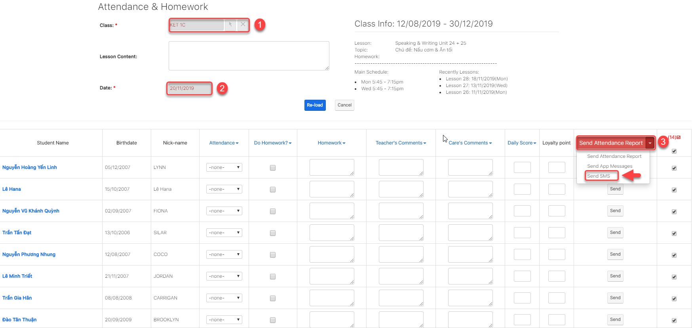
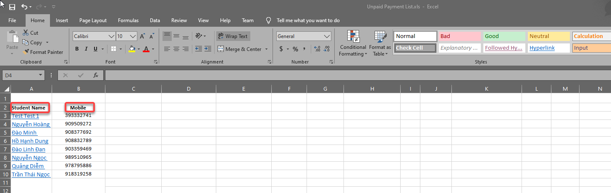
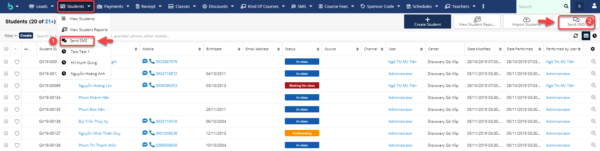
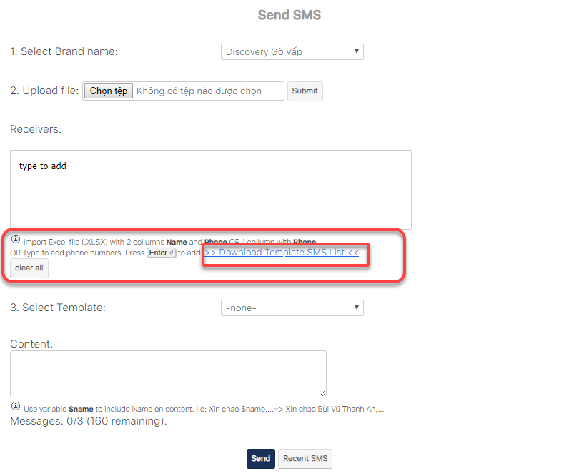
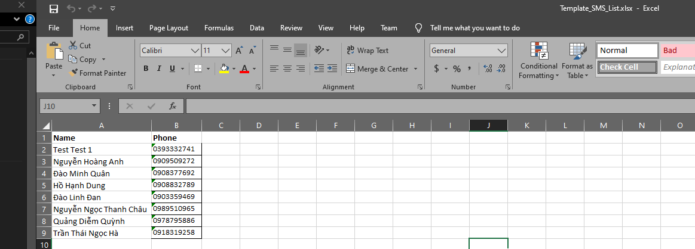

# SMS

## Gửi SMS theo Lớp

> Bươc 1: Click chuột vào module Classes sau đó click chọn lớp cần gửi SMS , thông báo nghỉ học, khai giảng,học phí… đến cho học viên.

> Bước 2: Tại màn hình chi tiết của Lớp học, click vào button **Attendance & Homework**

> Bước 3: Tại màn hình Attendance and Homework , click chọn Send SMS


**Ghi chú**:

1: Lớp thực hiện việc gửi SMS

2: Chọn ngày tiến hành gửi SMS

**Send Attendance Report** : gửi thông báo về việc đi học,trể,làm bài tập về nhà,comment, điểm daily score của học viên đến app

**Send App Messages** : Gửi tin nhắn đến App như lịch học bù, khai giảng,… 

**Send SMS** : Gửi tin nhắn SMS đến học viên.


## Gửi SMS theo Report

> Bước 1: Ví dụ gửi sms nhắc học viên chưa thanh toán tiền học phí

> Bước 2: Tại màn hình Report theo danh sách học viên chưa đóng tiền học phí, sau đó click Export Excel khi đi Apply \(xem báo cáo trước khi xuất báo cáo ra file\)


Ghi chú:

1: Thông tin filter để xuất báo cáo

2: click Apply để xem báo cáo 

3: Xuất report dạng **Excel**


> Bước 3: 
click Apply xem báo cáo, tiếp theo click **Export Excel**, tải file Excel về máy, sau đó bỏ những filed không cần thiết chỉ giữ lại 2 filed **Tên** và **Số điện thoại** \(filed số điện thoại phải có format là **Text**\)

> Bước 4: 
 Vào module Student, click **Send SMS** \(bạn có thể click chọn 1 trong 2\).

> Bước 5: 
 Tại màn hình Send SMS, click tải **Template SMS List** theo mẫu hệ thống và đưa danh sách học viên vào Template SMS List.

> Mẫu template sms

> 

> Bước 6: 
 Sau khi có được file dữ liệu như mẫu, tiến hành import vào hệ thống. Cuối cùng click **Send** để gửi tin nhắn.

> Sau khi Upload file lên hệ thống, click **Submit** hệ thống sẽ hiện thị danh sách học viên nhận được tin nhắn của trung tâm.


**Ghi chú:**

1: Danh sách học viên nhận tin nhắn \(bạn có thể nhập thêm số điện thoại\)

2: Nội dung gửi tin nhắn đến học viên \(chọn theo **Template** hoặc bạn có thể soạn nội dung ngẫu nhiên, để chèn tên học viên thì bạn gõ **$name**\). 

3: Kết quả: Thống kê số lượng bạn học viên nào đã nhận được tin nhắn, chưa nhận được tin nhắn, tổng số lượng tin nhắn đã gửi\)


> Như vậy, **DotB** đã thực hiện xong phần hướng dẫn gửi **SMS, c**ác bạn có thể tham khảo qua video clip **Hướng Dẫn Gửi SMS** [_**`Tại Đây`**_](https://www.youtube.com/watch?v=op1QYwRAQpI)_**\`\`**_
>
> Mọi thắc mắc xin liên hệ tổng đài 02873089091 \(miễn phí\) hoặc email cho chúng tôi tại địa chỉ: **contact@dotb.vn** để được tư vấn và giải đáp.
>
> Chúc Quý khách thành công!

