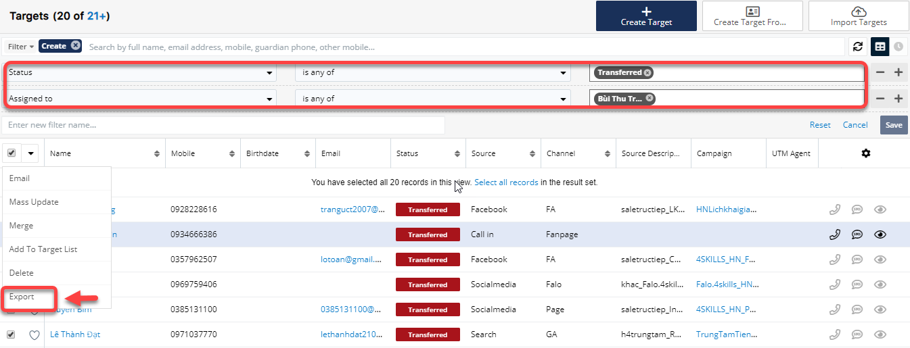
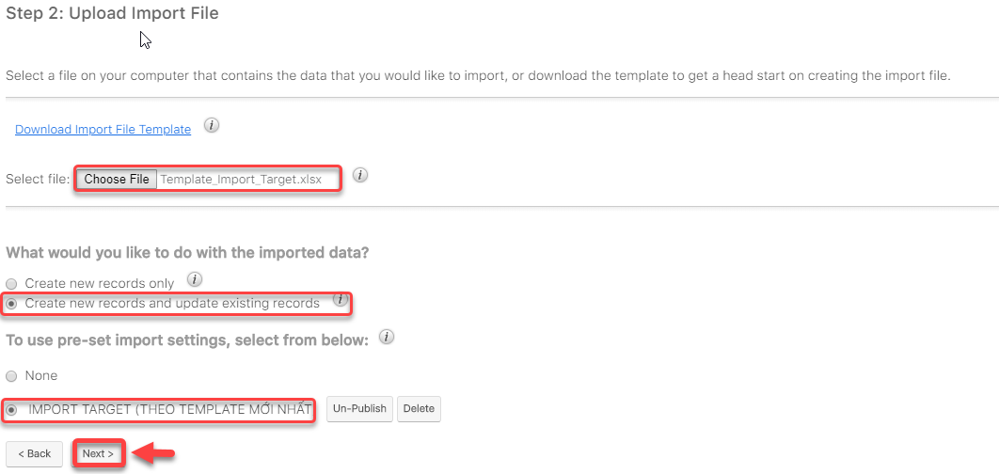

# Targets

> ****:point\_right: **Chi tiết các trạng thái Học viên thô (Target)**
>
> **+ **<mark style="color:green;">**New**</mark> : Targets mới được assign chưa được chưa chăm sóc&#x20;
>
> **+ **<mark style="color:blue;">**In Process**</mark> <mark style="color:blue;"></mark><mark style="color:blue;"></mark> : Targets đã có tương tác, gọi điện, tư vấn ****&#x20;
>
> **+ **<mark style="color:red;">**Converted**</mark>** :** Đã chuyển đổi từ Targets lên Leads
>
> **+ Dead :** Không có tiềm năng

## Import Target

> _Video hướng dẫn Import Target_



## Phân bổ người phụ trách

> Bước 1: Lọc dữ liệu của Target ở trạng thái **Wait for deliver.**  Action menu bên trái click chọn **Mass Update.**

.png>)

> Bước 2:  Tiếp theo chọn học viên theo cần assign, tại đây có thể chọn 1 hoặc nhiều học viên hoặc hàng loạt học viên theo điều kiện lọc,…. Để Assign to cho User click chọn Assign. Sau đó click **Update**.

.png>)


:woman\_gesturing\_ok: Ghi chú:

(+) : Thêm điều kiện Mass Update&#x20;

(-) : Bỏ điều kiện Mass Update


```
Nếu muốn chọn nhiều Target thì có thể làm theo hướng dẫn các step 1,2 như hình.
```


> Bước 3: Hệ thống sẽ thông báo Update thành công và Người phụ trách danh sách học viên đã tiếp nhận.

.png>)

## Update Lead hàng loạt từ Target

> Bước  1:  Export dữ liệu của Target ở trạng thái Transferred của từng Users đã Assign.



> Bước 2:&#x20;
> Những Field nằm trong khung màu đỏ là bắt buộc
>
> \+Bỏ những field trống.
>
> \+Bỏ filed ID,Tracker Key ,Assigned User ID,Team Set ID,Date Created,Date Modified,Modified By Name,Modified By ID,Created By,Created By ID,Full Name.
>
> \+Sửa filed  Lead Id thành ID.
>
> \+Cột Assigned User Name lấy UserName không lấy Full Name:
>
> &#x20;Ví dụ Full Name là Dương Huyền Trang , Username là [trangdh.emaa@gmail.com](mailto:trangdh.emaa@gmail.com) thì lấy Username đó điền vào cột Người phụ trách (**Assigned User Name**).


> Bước 3: Sau khi đã được File như mẫu tiến hành Import Lead theo các bước sau :

> Vào module Lead, chọn Import Lead.


> Click Next

.png>)

> Chọn file đã được chỉnh sửa theo Template, sau đó tích vào 2 ô chọn, click Next như hình



> Tiếp tục click Next

.png>)

> Check filed có khớp với nhau hay không, nếu không khớp, chọn sau cho đúng.

.png>)

>
> Tiếp theo click Next, sau đó click tiếp Import Now. Sau khi Update thành công hệ thống báo như sau:


##
