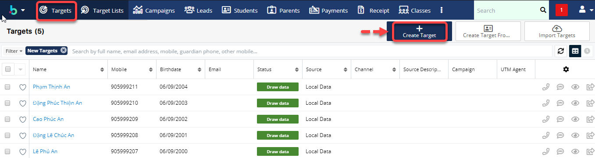
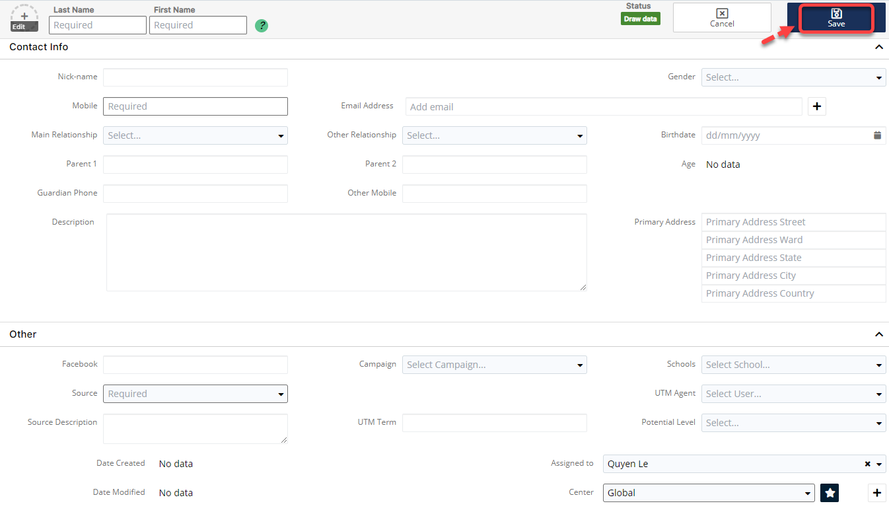
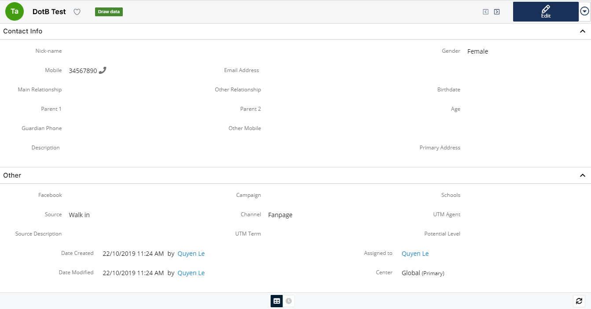
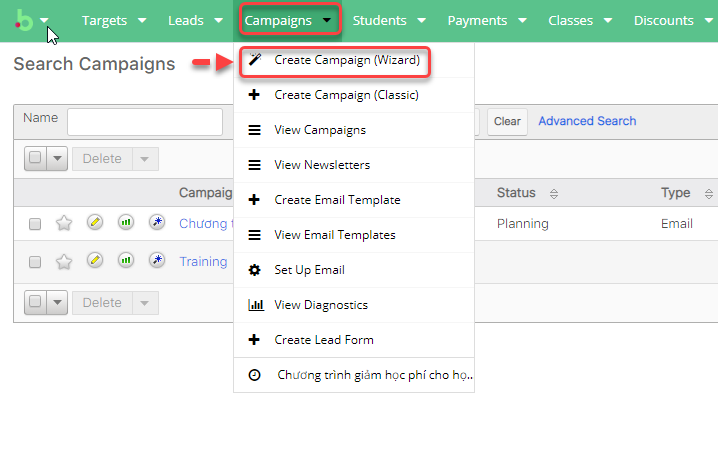
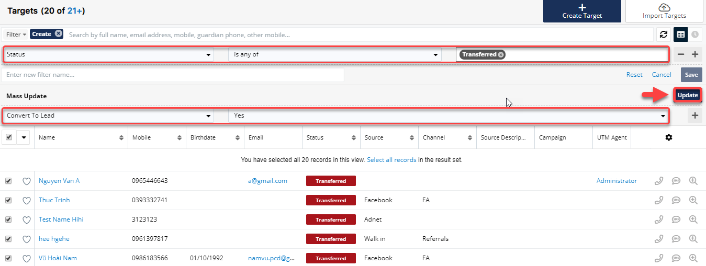
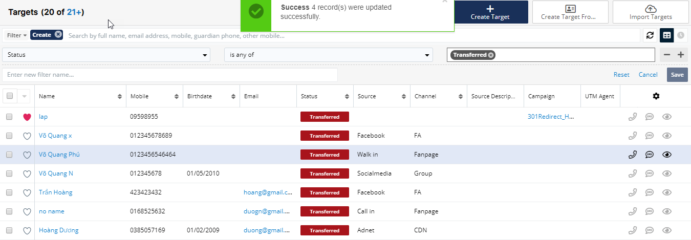
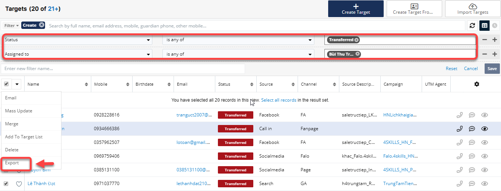
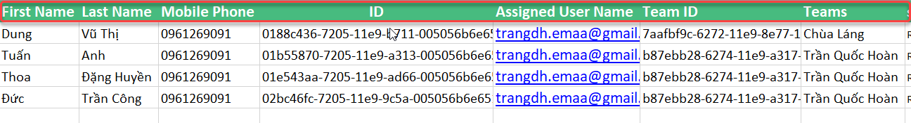
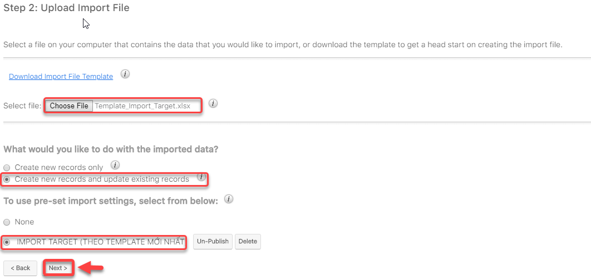
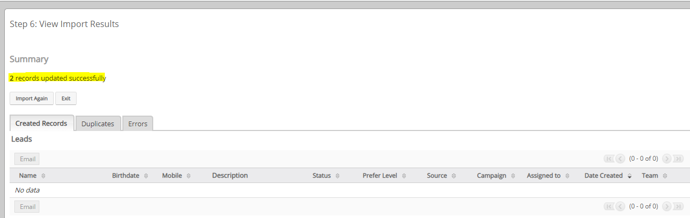

# Target

## Tạo Target

> Bước 1: Đưa chuột vào Menu Targets chọn Create Target.

> Bước 2: Tại màn hình tạo mới Target, nhập đầy đủ các thông tin cần thiết, Sau đó click Save để hoàn tất việc tạo ra 1 Target mới.

> Bước 3: Hệ thống hiển thị thông tin chi tiết của Target được tạo.

## Import Target

> Bước 1: Đưa chuột vào Menu Targets chọn Import Target.

> Bước 2: Import danh sách khách hàng thô từ file excel vào hệ thống.

> Bước 3: 
 Tải mẫu File Import \(nếu chưa có\), sau đó đưa file lên hệ thống click vào Choose File.Sau đó click **Next**.


**Ghi Chú:**

1 : Dowload file Import mẫu \(nếu chưa có\)

2 : Lựa chọn file để Import dữ liệu

3 : Click chọn tạo target mới từ dữ liệu được import

4 : Click chọn tạo và cập nhật target.

**Lưu ý** :

-       _****File Template dùng để Import dữ liệu Target vào hệ thống._ 

_**-**       Các cột có tô màu là những cột bắt buộc phải nhập dữ liệu \( các cột còn lại có thể có hoặc không \). Dữ liệu phải chính xác thì hệ thống mới Import học viên vào đúng._


> Bước 4: 
 Xác nhận các thuộc tính, Pre-set Import Setting. Click **Next**.

> Bước 5: Xác nhận việc ánh xạ các thuộc tính. Click Next.

> Bước 6:  Xác nhận việc kiểm tra trùng. Sau đó Click Tiến hành nhập dữ liệu để bắt đầu Import dữ liệu vào hệ thống.

> Bước 7: Kết quả sau khi Import.

## Convert Target

> Bước 1: Lọc dữ liệu của Target ở trạng thái **wait for deliver.** Action menu bên trái click chọn **Mass Update**.

> Bước 2:  Tiếp theo chọn Convert to Lead là Yes, sau đó click Update.

> Bước 3: Hệ thống sẽ thông báo Update thành công và chuyển dữ liệu về Leads.

## Phân bổ người phụ trách

> Bước 1: Lọc dữ liệu của Target ở trạng thái **wait for deliver.**  Action menu bên trái click chọn Mass Update.

> Bước 2:  Tiếp theo chọn học viên theo cần assign,…. Để Assign to cho User click chọn Assign. Sau đó click Update.


Ghi chú:

\(+\) : Thêm điều kiện Mass Update 

\(-\) : Bỏ điều kiện Mass Update


> Bước 3: Hệ thống sẽ thông báo Update thành công và Người phụ trách danh sách học viên đã tiếp nhận.

## Update Lead hàng loạt từ Target

> Bước  1:  Export dữ liệu của Target ở trạng thái Transferred của từng Users đã Assign.

> Bước 2: 
Những Field nằm trong khung màu đỏ là bắt buộc
>
> +Bỏ những field trống.
>
> +Bỏ filed ID,Tracker Key ,Assigned User ID,Team Set ID,Date Created,Date Modified,Modified By Name,Modified By ID,Created By,Created By ID,Full Name.
>
> +Sửa filed  Lead Id thành ID.
>
> +Cột Assigned User Name lấy UserName không lấy Full Name:
>
>  Ví dụ Full Name là Dương Huyền Trang , Username là [trangdh.emaa@gmail.com](mailto:trangdh.emaa@gmail.com) thì lấy Username đó điền vào cột Người phụ trách \(**Assigned User Name**\).

> Bước 3: Sau khi đã được File như mẫu tiến hành Import Lead theo các bước sau :

> Vào module Lead, chọn Import Lead.

> Click Next

> Chọn file đã được chỉnh sửa theo Template, sau đó tích vào 2 ô chọn, click Next như hình

> Tiếp tục click Next

> Check filed có khớp với nhau hay không, nếu không khớp, chọn sau cho đúng.

> Tiếp theo click Next, sau đó click tiếp Import Now. Sau khi Update thành công hệ thống báo như sau:

## 

