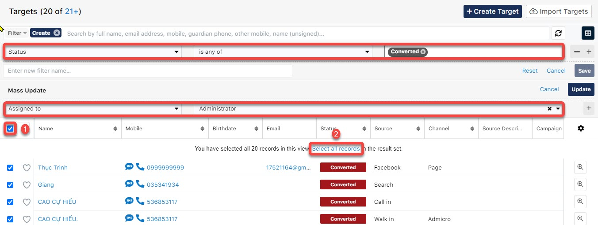

# 🤵♀ Phân bổ người phụ trách

> Bước 1: Lọc dữ liệu của Target ở trạng thái **Wait for deliver.**  Action menu bên trái click chọn **Mass Update.**

.png>)

> Bước 2:  Tiếp theo chọn học viên theo cần assign, tại đây có thể chọn 1 hoặc nhiều học viên hoặc hàng loạt học viên theo điều kiện lọc,…. Để Assign to cho User click chọn Assign. Sau đó click **Update**.

.png>)


:woman\_gesturing\_ok: Ghi chú:

(+) : Thêm điều kiện Mass Update&#x20;

(-) : Bỏ điều kiện Mass Update


```
Nếu muốn chọn nhiều Target thì có thể làm theo hướng dẫn các step 1,2 như hình.
```



> Bước 3: Hệ thống sẽ thông báo Update thành công và người phụ trách danh sách học viên đã tiếp nhận.

.png>)

