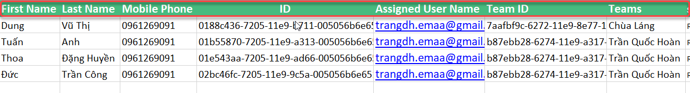
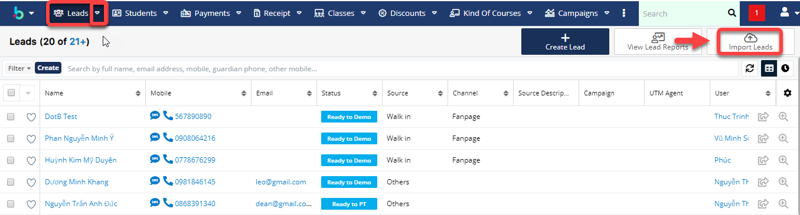
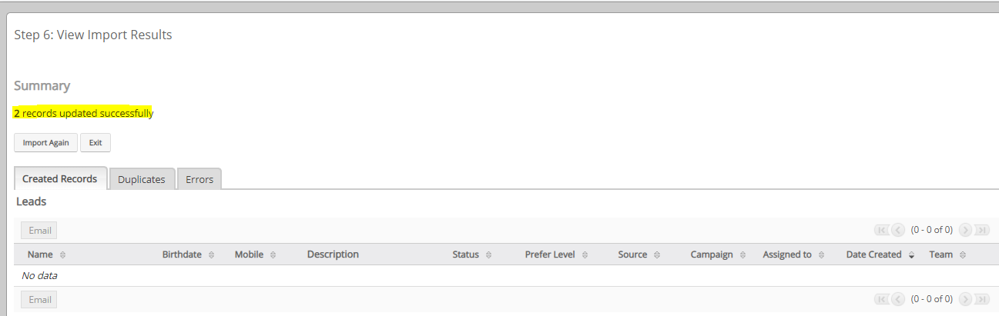

# 💻 Update Lead hàng loạt từ Target

> Bước  1:  Export dữ liệu của Target ở trạng thái Transferred của từng Users đã Assign.

.png>)

> Bước 2:&#x20;
> Những Field nằm trong khung màu đỏ là bắt buộc:
>
> \+Bỏ những field trống.
>
> \+Bỏ filed ID, Tracker Key ,Assigned User ID, Team Set ID, Date Created, Date Modified, Modified By Name, Modified By ID, Created By, Created By ID, Full Name.
>
> \+Sửa filed  Lead Id thành ID.
>
> \+Cột Assigned User Name lấy User Name không lấy Full Name:
>
> &#x20;Ví dụ Full Name là Dương Huyền Trang , Username là [trangdh.emaa@gmail.com](mailto:trangdh.emaa@gmail.com) thì lấy Username đó điền vào cột Người phụ trách (**Assigned User Name**).

> Bước 3: Sau khi đã được File như mẫu tiến hành Import Lead theo các bước sau :

> Vào module Lead, chọn Import Lead.

> Click Next

.png>)

>

> Tiếp tục click Next

.png>)

> Check filed có khớp với nhau hay không, nếu không khớp, chọn sau cho đúng.

.png>)

>
> Tiếp theo click Next, sau đó click tiếp Import Now. Sau khi Update thành công hệ thống báo như sau:

##
